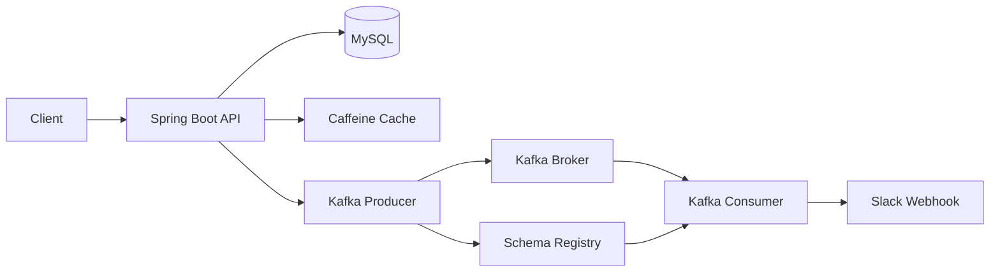

# Catch Table

식당을 조회하고 원격으로 웨이팅을 등록·관리할 수 있는 백엔드 프로젝트입니다.

매장 관리자가 고객을 호출하면 Kafka와 Avro를 통해 이벤트를 전달하고, 별도의 Consumer가 Slack 알림을 전송합니다.

## 주요 기능

- 카테고리별 식당 목록 조회
- 식당 상세 정보 및 메뉴 조회
- 웨이팅 등록 및 취소
- 매장별 현재 웨이팅 현황 조회
- 고객별 웨이팅 순서와 예상 대기시간 조회
- 매장 관리자용 웨이팅 현황 조회 및 고객 호출
- Kafka·Avro 기반 호출 이벤트 발행
- Slack Webhook을 통한 입장 및 다음 순서 안내
- Caffeine 기반 식당 목록 캐싱

## 시스템 구성



### Slack 알림 흐름

```text
매장 관리자 → API: 웨이팅 고객 호출
API → Avro: WaitingCall 메시지 생성
API → Kafka: waiting-call-slack 토픽으로 메시지 발행
Kafka → Consumer: Avro 메시지 전달
Consumer → Slack: 호출 고객 입장 안내 전송
Consumer → Slack: 다음 고객 대기 안내 전송 (다음 고객이 있는 경우)
API → MySQL: 호출 고객 상태를 CALLED로 변경
```

`WaitingCall` 이벤트에는 매장명, 호출 대기번호, 다음 대기번호, Slack Webhook URL이 포함됩니다.

## 기술 스택

| 구분 | 기술 |
| --- | --- |
| Language | Java 17 |
| Framework | Spring Boot 3.3.1 |
| Database | MySQL, Spring Data JPA |
| Messaging | Apache Kafka, Spring Kafka |
| Serialization | Apache Avro, Confluent Schema Registry |
| Notification | Slack Incoming Webhook |
| Cache | Caffeine |
| Build | Gradle Multi-Module |
| Test | JUnit 5, Spring Boot Test |

## 멀티모듈 구조

```text
catch-table
├── multi-module-api       # REST API와 애플리케이션 실행 모듈
├── multi-module-database  # Entity, Repository, Service 및 Kafka Producer
├── kafka-consumer         # Kafka 메시지 소비 및 Slack 알림 전송
├── common-avro            # WaitingCall Avro 스키마와 생성 모델
└── buildSrc               # 공통 Gradle 설정
```

| 모듈 | 역할 |
| --- | --- |
| `multi-module-api` | 클라이언트 요청을 처리하는 REST Controller와 API 서버 |
| `multi-module-database` | 식당·고객·웨이팅 데이터 처리와 Kafka 이벤트 발행 |
| `kafka-consumer` | `waiting-call-slack` 토픽을 구독하고 Slack 메시지 전송 |
| `common-avro` | Producer와 Consumer가 함께 사용하는 `WaitingCall` 스키마 관리 |

## 주요 API

| Method | Endpoint | 설명 |
| --- | --- | --- |
| `GET` | `/restaurant/{category}` | 카테고리별 식당 목록 조회 |
| `GET` | `/restaurant/{restaurantId}/detail` | 식당 상세 정보 및 메뉴 조회 |
| `POST` | `/restaurant/{restaurantId}/waiting` | 웨이팅 등록 |
| `POST` | `/restaurant/{restaurantId}/waiting/{waitingId}/cancel` | 웨이팅 취소 |
| `GET` | `/restaurant/{restaurantId}/waiting/status` | 식당 웨이팅 현황 조회 |
| `POST` | `/restaurant/{restaurantId}/my-waiting/{waitingId}` | 고객의 웨이팅 상태 조회 |
| `GET` | `/restaurant/{restaurantId}/waiting/status/owner` | 매장 관리자용 웨이팅 현황 조회 |
| `POST` | `/waiting/call` | 웨이팅 고객 호출 및 Slack 알림 이벤트 발행 |

식당 카테고리는 `KOREAN`, `CHINESE`, `JAPANESE`, `WESTERN`을 지원합니다.

## 실행 방법

### 1. 요구 사항

- JDK 17
- MySQL
- Kafka
- Confluent Schema Registry
- Slack Incoming Webhook URL

### 2. MySQL 실행

프로젝트의 Docker Compose 설정을 이용할 수 있습니다.

```bash
docker compose up -d db
```

### 3. 애플리케이션 설정

`multi-module-api/src/main/resources/application.yml`에 다음 항목을 실행 환경에 맞게 설정합니다.

- MySQL URL, 사용자명, 비밀번호
- Kafka Bootstrap Server
- Schema Registry URL

`kafka-consumer/src/main/resources/application.yml`에는 다음 항목을 설정합니다.

- Kafka Bootstrap Server
- Schema Registry URL

Slack Webhook URL은 식당 데이터의 `webhookUrl`에 저장되어 있어야 합니다. 실제 비밀번호와 Webhook URL 같은 민감 정보는 Git에 커밋하지 않는 것을 권장합니다.

### 4. 빌드

```bash
./gradlew clean build
```

### 5. 서버 실행

API 서버와 Kafka Consumer를 각각 실행합니다.

```bash
./gradlew :multi-module-api:bootRun
```

```bash
./gradlew :kafka-consumer:bootRun
```

기본 API 서버 포트는 `1017`입니다.

## Avro 이벤트 스키마

```json
{
  "type": "record",
  "name": "WaitingCall",
  "namespace": "com.project.catchtable.avro",
  "fields": [
    { "name": "restaurantName", "type": "string" },
    { "name": "waitingNumber", "type": "int" },
    { "name": "nextWaitingNumber", "type": "int" },
    { "name": "webhookUrl", "type": "string" }
  ]
}
```

Avro Java 클래스는 `common-avro/src/main/avro/WaitingCall.avsc`를 기준으로 빌드 시 생성됩니다.

## 테스트

전체 테스트를 실행합니다.

```bash
./gradlew test
```

모듈별 테스트는 다음과 같이 실행할 수 있습니다.

```bash
./gradlew :multi-module-api:test
./gradlew :multi-module-database:test
./gradlew :kafka-consumer:test
```
